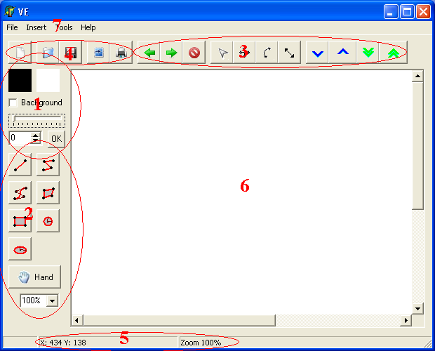
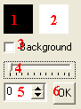
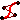
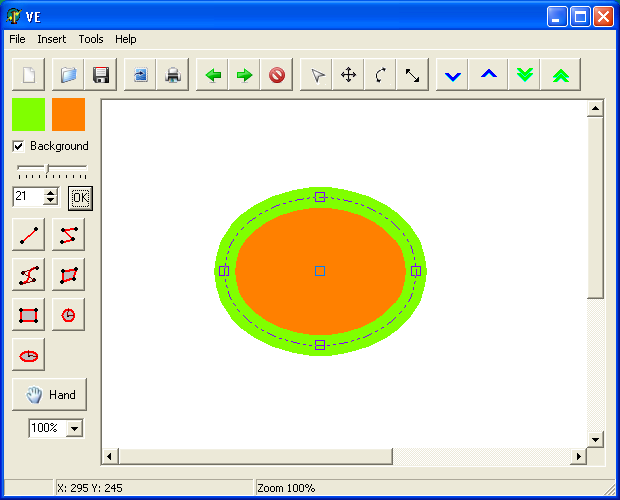
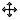

VEditor – užívateľská príručka

Úvod
====

Veditor je jednoduchý vektorový editor, určený na kreslenie útvarov
a ich ukladanie vo vektorovej podobe. Podporuje tlač a export obrázkov
do formátu Windows Bitmap (.bmp).

Systémové požiadavky
====================

Minimálne požiadavky na hardware VEditor nemá, ale na veľmi pomalých
zostavách môžu niektoré operácie trvať neprimerane dlho. Program funguje
iba pod operačnými systémami z rodiny Windows (testované boli Windows XP
a Windows Vista 64-bit). Program nemá žiadne iné požiadavky na
nainštalovaný software a hardware.

Prostredie
==========

1. Nastavenie farby a šírky  
2. Nástroje na kreslenie a zoom  
3. Nástroje na manipuláciu s objektmi  
4. Práca so súborom  
5. Stavový riadok  
6. Plocha na kreslenie  
7. Hlavné menu

Nastavenie farby a šírky
------------------------

1. Nastavenie farby čiary na objekte
2. Nastavenie výplne objektu (má zmysel iba pri niektorých útvarov)
3. CheckBox na zapínanie/vypínanie výplne objektu.
4. Posuvník nastavujúci šírku čiary (po nastavení treba kliknúť na OK)
5. Iná možnosť nastavenia šírky čiary
6. Tlačidlo potvrdzujúce šírku čiary

  
Nástroje na kreslenie
---------------------

Všetky útvary pri kreslení získajú práve nastavené vlastnosti (farba,
hrúbka, výplň). Po nakreslení treba ešte kliknúť pravým tlačidlom myší
na potvrdenie operácie.

| Akcia | Popis |
| --- | --- |
|  | Kreslenie **úsečky (segment line)**. Úsečka sa reslí omocou dvoch kliknutí do plochy, kde prvé určuje začiatok úsečky a druhé koniec. |
|  | Nástroj na kreslenie **lomenej čiary (polyline)**, reslí sa viacnásobným kliknutím do plochy, kde vždy po ďalšom kliknutí sa pridá bod na koniec. |
|  | Kreslenie **bézierových kriviek (bezier curve)**, používa sa podobne ako lomená čiara, akurát je výsledkom krivka. Stupeň krivky nie je nijak obmedzený. |
|  | **Polygón (polygon),** podobá sa na lomenú čiaru, akurát výsledkom je uzavretý útvar (aplikuje sa aj výplň). |
|  | Nástroj na kreslenie **obdĺžnika (rectangle),** podobne ako pri polygóne sa aj tu aplikuje výplň. Samotný útvar sa kreslí iba dvoma kliknutiami. Prvé určí pozíciu hlavného bodu a druhé bodu protiľahlému k hlavnému. |
|  | Kreslenie **kružnice (circle)**, prvým kliknutím sa určí stred a ďalším polomer. Tiež sa aplikuje výplň. |
|  | **Elipsa (ellipse),** rovnako ako pri kružnice, prvým kliknutím uložíme stred a ďalšími dvoma nastavíme dĺžku polosí. Podobne ako pri kružnici sa aplikuje výplň. |

**Príklad:**

Príklad kreslenia elipsy. Môžeme si všimnúť nastavenú farbu čiary a výplne,
ktoré sa nám hneď ukazujú na ploche pri vytváraní elipsy.

Nástroje na manipuláciu s objektmi
----------------------------------

Prvým kliknutím na útvar (pozor, treba kliknúť úplne presne) sa označí.
Potom s ním môžeme manipulovať podľa zvoleného nástroja. Ďalší objekt je
možné pridať/odobrať do aktuálnej skupiny pomocou Ctrl a kliknutia naň.
Pravým tlačidlom sa ruší aktuálne vybratá skupina.

Počas výberu fungujú funkcie na zmenu farby, výplne... Fungujú aj
funkcie pre posun po osi Z (ale iba ak je vybratý práve jeden útvar)

| Akcia | Popis |
| --- | --- |
|  | **Select** – slúži iba na označovanie. |
|  | **Move** – umožňuje posúvanie objektov. |
|  | **Rotate** – slúži na rotovanie objektov okolo zadaného bodu |
|  | **Resize** – menenie veľkosti objektov, ak sa dajú ridávať body (lomená čiara, polygón, beziérová krivka), pridávajú sa kliknutím na miesto, kde chcete pridať bod, mažú sa dvojklikom na bod, ktorý ma byť vymazaný. |
|     | **Posúvanie po osi z** – o jednu úroveň dole, o jednu hore, úplne do pozadia, do popredia. |
|   | **Vzad (undo) a vpred (redo)** – odvolá poslednú vykonanú akciu, resp. ju vykoná znova. Toto sa dá vykonať aj viackrát, čím sa vracia história úprav obrázka. |
|  | **Zmaž (delete)** – zmaže aktuálne zvolené objekty. |

Práca so súborom
----------------

| Akcia | Popis |
| --- | --- |
|  | **Nový (new)** – otvorí dialóg s nastaveniami rozlíšenia nového obrázku a potom ho vytvorí. |
|   | **Otvoriť (open) a uložiť (save)** – otvorí/uloží aktuálny obrázok do vlastného vektorového formátu (.vef). |
|  | **Export (export)** – exportuje obrázok do bitmapy. |
|  | **Tlačiť (print)** – vytlačí obrázok, predtým ukáže dialóg s nastaveniami tlačiarne. |

Hand tool
---------

Tento nástroj slúži na kreslenie útvarov voľnou rukou, ktoré by sa mali 
konvertovať do vektorovej podoby. Kresliť sa musí jedným ťahom, hneď po pustení
tlačidla myši sa program pokúsi útvar rozoznať a previesť do vektorovej
podoby. Tento nástroj funguje so skoro všetkými útvarmi okrem
bézierových kriviek. Pri používaní treba kresliť čo najpresnejšie a bez
zbytočných zdržaní.
